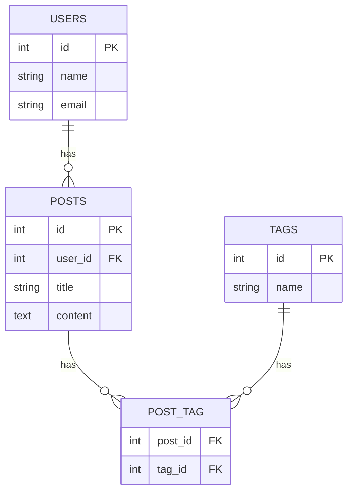

# Gün 1 — Web / PHP / SQL Hızlı Tekrar

> Web, PHP ve SQL konularında hızlı tekrar notları.

---

## 1. WEB

### Client Nedir?

Bir servisten istekte bulunan taraftır. Tarayıcı, mobil uygulama gibi örnekleri vardır.

### Server Nedir?

Clientten gelen istekleri karşılayan ve cevap dönen taraftır. Örneğin veri getirir.

### Backend Ne Yapar?

Uygulamanın kullanıcı tarafından doğrudan görülmeyen kısmıdır genellikle: Database ile etkileşime girer, API sağlar, veriyi işler ve frontende gönderir.

**Örneğin:**

```text
Frontend
   │
   │ GET /users/15
   ▼
Backend
   │
   ▼
Database
   │
   ▼
Backend
   │
   │ JSON response
   ▼
Frontend
```

### Frontend Ne Yapar?

Kullanıcının gördüğü ve etkileşim kurduğu kısımdır. Butonlar, sayfalar, tablolar gibi arayüzleri oluşturur. API'lere istek gönderir. Gelen veriyi de kullanıcıya gösterir.

### Full Stack Nedir?

Frontendi de Backendi de yazabilen kişilere denir.

### Monolith Nedir?

Uygulamanın ana parçalarının tek bir uygulama veya proje içerisinde birlikte çalıştığı mimaridir. Backend ve Frontend görevlerini çoğunlukla aynı uygulamanın içinde bulundurur.

```text
Browser
   │
   ▼
Laravel
   │
   ├── Controller  → isteği karşılar
   ├── Model       → veritabanıyla çalışır
   ├── Blade       → HTML üretir
   └── Database
```

---

## 2. HTTP

### HTTP Metotları

|  Method  | Görevi                         |
| :------: | ------------------------------ |
|   `GET`  | veri getir                     |
|  `POST`  | veri oluştur                   |
|   `PUT`  | kaynağı tamamen güncelle       |
|  `PATCH` | kaynağın bir bölümünü güncelle |
| `DELETE` | sil                            |

### Status Kodları

|  Kod  | Tür           | Açıklama                                                |
| :---: | ------------- | ------------------------------------------------------- |
| `1xx` | Informational | İstek alındı, işlem devam ediyor.                       |
| `2xx` | Success       | İstek başarılı.                                         |
| `3xx` | Redirection   | Başka bir yere yönlendirme var.                         |
| `4xx` | Client Error  | Hata büyük ölçüde client tarafındaki istekten kaynaklı. |
| `5xx` | Server Error  | Hata server tarafında.                                  |

### 2xx

```text
200 OK
201 Created
204 No Content
```

### 3xx

```text
301 Moved Permanently
302 Found
```

### 4xx

```text
400 Bad Request

401 Unauthenticated
└── kullanıcı bilinmiyor

403 Forbidden
└── kullanıcı biliniyor ancak yetki yok

404 Not Found
422 Validation Error
```

### 5xx

```text
500 Internal Server Error
502 Bad Gateway
503 Service Unavailable
```

---

## 3. Cookie / Session / Token

### Cookie

Browser tarafında saklanan küçük veri.

### Session

Server tarafından kullanıcıya ait durum tutulur. Browser genellikle session ID'yi cookie ile taşır.

### Token

Client her istekte kimliğini kanıtlayan bir token gönderir.

---

## 4. PHP Tekrar

### PHP Nedir?

Web siteleri ve uygulamaları yapmak için kullanılan, sunucu tarafında çalışan açık kaynaklı bir programlama ve betik dilidir. Dinamik web sayfaları üretmek için HTML içine kolayca eklenebilir.

### Örnek Class

```php
class User
{
    public function __construct(
        public string $name,
        private string $password
    ) {}

    public function getName(): string
    {
        return $this->name;
    }
}
```

### 4.1 Class

Nesnenin şablonudur.

```php
class User
{
}
```

---

### 4.2 Object

Classtan oluşturulan gerçek örnektir.

```php
$user = new User("Ahmet", "1234");
```

Burada `$user` bir objecttir.

---

### 4.3 Property

Objectin tuttuğu verilerdir.

Yukarıdaki örnek için `name` ve `password` bir propertydir.

```php
public string $name;
private string $password;
```

---

### 4.4 Method

Class içerisinde bulunan fonksiyondur.

`getName()` bir methodtur.

```php
public function getName(): string
{
    return $this->name;
}
```

---

### 4.5 Constructor

Object oluşturulduğu anda otomatik çalışan özel methoddur.

```php
public function __construct(
    public string $name,
    private string $password
) {}
```

`public function __construct` buna örnektir.

---

### 4.6 `$this`

Şu an üzerinde işlem yaptığımız objecti ifade eder.

```php
public function getName(): string
{
    return $this->name;
}
```

---

### 4.7 Public

Her yerden erişebilir.

```php
public string $name;

echo $user->name; // çalışır
```

---

### 4.8 Private

Sadece o classın içerisinden erişebilir.

```php
private string $password;

echo $user->password; // çalışmaz
```

---

### 4.9 Protected

Private gibi dışarıdan erişilemez fakat child classlar erişebilir.

---

### 4.10 Inheritance

Bir class başka bir classın özelliklerini ve methodlarını miras alabilir.

```php
class Admin extends User
{
}
```

---

### 4.11 Type Hint

Fonksiyona veya propertyye hangi tipte veri gelmesi gerektiğini belirtirsin.

```php
function findUser(int $id)
{
}
```

---

### 4.12 Return Type

Fonksiyonun ne döndüreceğini belirtir.

```php
function getName(): string
{
    return "Ahmet";
}
```

Fonksiyonun `string` döndürmesi gerekir.

---

# 5. SQL Tekrarı

## 5.1 İlişkiler

### User — Post

```text
User 1 -------- N Post
```

Bir kullanıcı birçok post yazabilir. Her post ise bir kullanıcıya aittir.

### Post — Tag

```text
Post N -------- N Tag
```

Bir postta birçok tag olabilir, aynı tag birçok postta kullanılabilir.

### Örnek Tablo Yapısı

```text
users
-----
id PK
name
email

posts
-----
id PK
user_id FK
title
content

tags
-----
id PK
name

post_tag
--------
post_id FK
tag_id FK
```

### İlişki Diyagramı



İlişkiler:

```text
users.id
   │
   └── posts.user_id


posts.id
   │
   └── post_tag.post_id


tags.id
   │
   └── post_tag.tag_id
```

---

## 5.2 Primary Key Neden Var?

Tablodaki her satırı benzersiz şekilde tanımlar.

```sql
SELECT *
FROM users
WHERE id = 2;
```

> Primary Key hem unique olur hem de `NULL` olamaz.

---

## 5.3 Foreign Key Ne Sağlar?

Başka bir tablodaki kayda referans verir.

Foreign Key ayrıca veri bütünlüğü sağlar. Örneğin sistemde `user id = 4` yoksa, `user_id = 4` olan post eklenmesini engelleyebilirsin.

```text
users.id
   │
   └── posts.user_id
```

---

## 5.4 Bu SQL Ne Yapıyor?

```sql
SELECT *
FROM posts
WHERE user_id = 3
ORDER BY created_at DESC
LIMIT 10;
```

```text
posts tablosuna git
        ↓
user_id = 3 olanları bul
        ↓
en yeniden eskiye sırala
        ↓
ilk 10 tanesini getir
```

`DESC` = descending, yani büyükten küçüğe / yeniden eskiye.

---

## 5.5 INNER JOIN

İki tabloyu ilişkili kolonlardan birleştirir.

```sql
SELECT posts.title, users.name
FROM posts
INNER JOIN users
ON posts.user_id = users.id;
```

### users

| id | name |
| -: | ---- |
|  3 | Ali  |
|  4 | Ayşe |

### posts

| id | user_id | title   |
| -: | ------: | ------- |
|  1 |       3 | PHP     |
|  2 |       4 | Laravel |

### JOIN Sonucu

| title   | name |
| ------- | ---- |
| PHP     | Ali  |
| Laravel | Ayşe |

Buradaki bağlantı:

```text
posts.user_id
      │
      ▼
users.id
```

---

## 5.6 LEFT JOIN

Soldaki tablodaki bütün kayıtları getirir.

```sql
SELECT *
FROM users
LEFT JOIN posts
ON users.id = posts.user_id;
```

Ali'nin postu yoksa bile Ali gelir:

| user   | post    |
| ------ | ------- |
| Ali    | `NULL`  |
| Ayşe   | Laravel |
| Mehmet | PHP     |

---

## 5.7 INDEX Ne İşe Yarar?

Database bütün tabloyu tek tek taramak yerine index üzerinden daha hızlı bulabilir.

---

## 5.8 Neden Her Kolona Index Koymuyoruz?

* Disk alanı kullanır.
* `INSERT` işlemlerini yavaşlatabilir.
* `UPDATE` işlemlerini yavaşlatabilir.
* `DELETE` işlemlerini yavaşlatabilir.

Çünkü veri değiştiğinde index'in de güncellenmesi gerekir.

---

## 5.9 Many-to-Many Neden Pivot Tablo Gerektirir?

Örneğin:

```text
Post 1 → PHP, Laravel, Backend
Post 2 → PHP, SQL

PHP     → Post 1, Post 2
Laravel → Post 1
```

Yani iki tarafta da birden fazla ilişki var.

Bu yüzden araya `post_tag` tablosu koyuyoruz.

```text
posts
  │
  │
  ▼
post_tag
  ▲
  │
  │
tags
```

Örneğin:

| post_id | tag_id |
| ------: | -----: |
|       1 |      1 |
|       1 |      2 |
|       1 |      3 |
|       2 |      1 |
|       2 |      4 |

Bu tablo sayesinde:

```text
Post 1
├── PHP
├── Laravel
└── Backend

Post 2
├── PHP
└── SQL
```

şeklinde bir ilişki kurulabilir.

---

## Gün 1 İlerleme

* [x] Web Temelleri
* [x] HTTP
* [x] Cookie / Session / Token
* [x] PHP Temelleri
* [x] PHP OOP Temelleri
* [x] SQL İlişkileri
* [x] Primary Key / Foreign Key
* [x] JOIN
* [x] INDEX
* [x] Many-to-Many / Pivot Table
